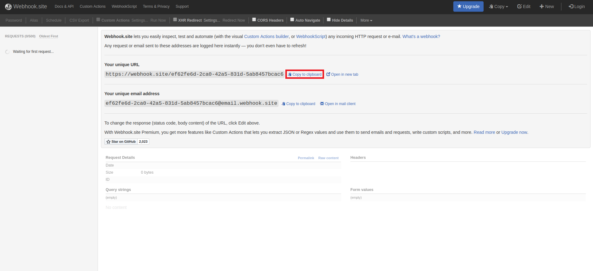
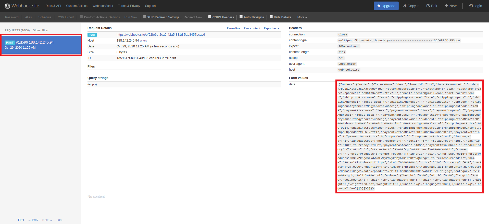

# Using "Order confirm" webhook

## Introduction

There may be needs that require a message sent by the web store to notify us when a new order has been placed in the web store.
These notifications, also known as **"webhooks"**, are an API concept that provides information in "real-time" to other systems.
For example, we can use this event to ask our customers for their opinions on the ordered products.
A more precise description of the webshop's webhook system can be found [here](https://support.shoprenter.hu/hc/hu/articles/215106408-Automatizmusok).

## Example

In the example below, we use [**Webhook Resource**](../../api/webhook.md) to create a new webhook sending automation,
which immediately sends the order data to the url provided by us after each order is placed.
To test the sent webhooks, we will use the free [**Webhook.site**](https://webhook.site), which provides the url that we need to enter when creating a webhook.



The webhook is sent immediately, which can be specified by not specifying the **webHookDelay** parameter during posting.

**Request**

<table>
  <tr>
    <td><b>method:</b></td>
    <td>POST</td>
  </tr>
  <tr>
    <td><b>url:</b></td>
    <td>http://shopname.api.myshoprenter.hu/webHooks</td>
  </tr>
  <tr>
    <td><b>headers:</b></td>
    <td>
        Accept:application/json<br>
        Content-Type:application/json
    </td>
  </tr>
</table>

**Request**

```json
{
    "event": "order_confirm",
    "status": "1",
    "label": "Test webhook",
    "webHookParameters": [
        {
            "type": "json",
            "url": "https://webhook.site/ef62fe6d-2ca0-42a5-831d-5ab8457bcac6"
        }
    ]
}
```

**Response**

```json
{
    "href": "http://shopname.api.myshoprenter.hu/webHooks/d2ViSG9vay1ub3RpZmljYXRpb25faWQ9Njg=",
    "id": "d2ViSG9vay1ub3RpZmljYXRpb25faWQ9Njg=",
    "event": "order_confirm",
    "status": "1",
    "label": "Test webhook",
    "webHookParameters": [
        {
            "type": "json",
            "url": "https://webhook.site/ef62fe6d-2ca0-42a5-831d-5ab8457bcac6",
            "webHook": {
                "href": "http://shopname.api.myshoprenter.hu/webHooks/d2ViSG9vay1ub3RpZmljYXRpb25faWQ9Njg="
            }
        }
    ],
    "webHookDelay": []
}
```

After that, if a new order is placed, the received webhook can be seen on webhook.site.



