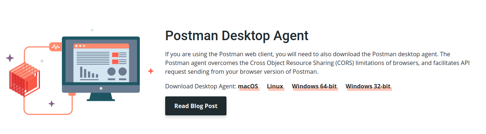
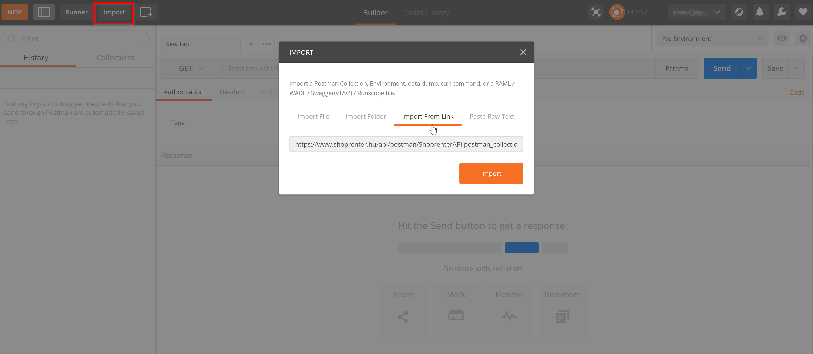
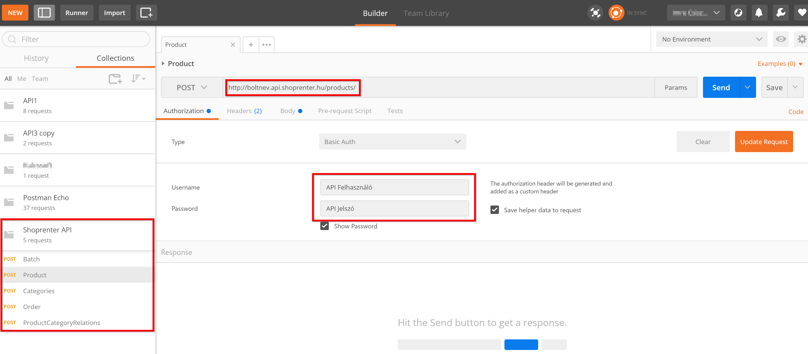
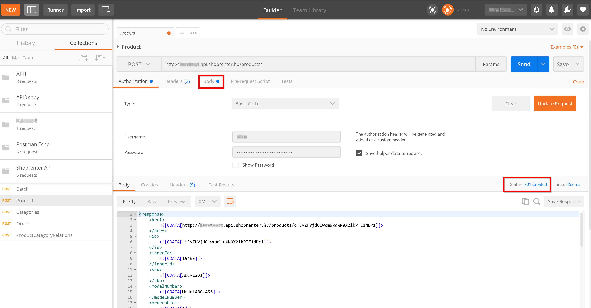
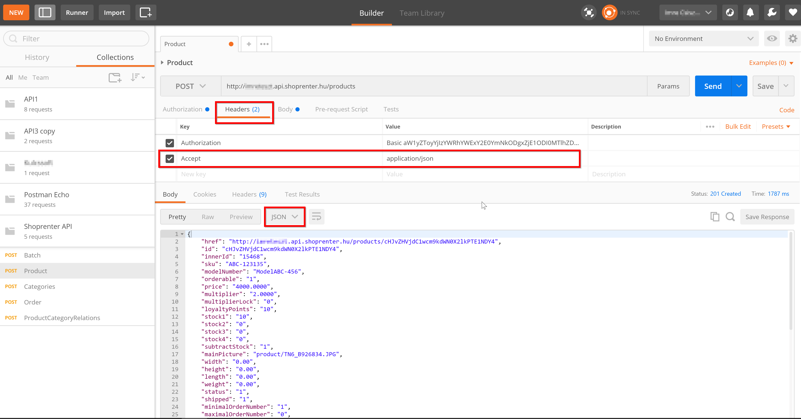
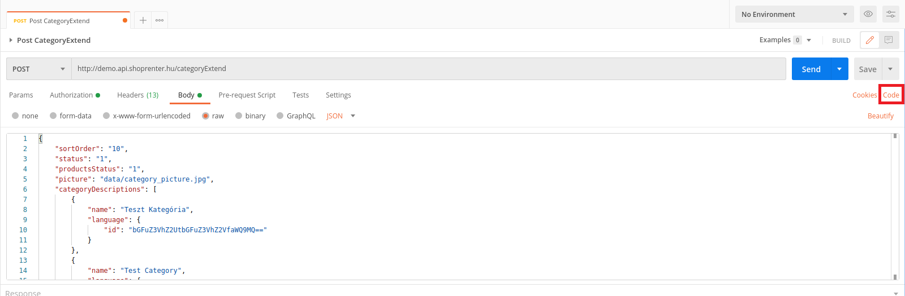
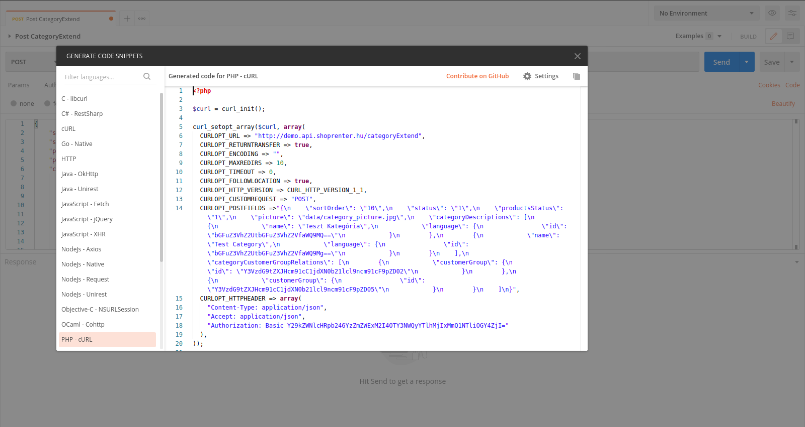

# Use of Postman and example codes

## Examples for API usage

- You can access the API client for PHP testing by [clicking here](https://github.com/Shoprenter/api-client).
- Example collections of Shoprenter API. (You can find further information on the usage in the article) [Download](https://register.shoprenter.hu/api/postman/ShoprenterAPI.postman_collection.json)
- [Further examples](../api-examples/01_0_product_special.md)

## Use of Postman

Postman is a complete toolset for API developers, the program makes it quick and efficient to work with API, as it supports all workflows of developers. The software is available for the following platforms: Mac OS X, Windows, Linux and Chrome.

### Installation

Select which system you use on[the website of Postman](https://www.postman.com/downloads/) and click on download.

#### macOS installation

Once download is finished, drag and drop the file to the “Applications” folder. You can run the application by double click.

#### Windows installation

- Download the setup file-t.
- Run the installer

#### Linux installation

Installation on Linux may be different. You can find further information on this in the following guide: [Postman app on Ubuntu 16.04.](https://www.bluematador.com/blog/postman-how-to-install-on-ubuntu-1604?utm_source=hootsuite&utm_medium=twitter&utm_campaign=)

#### Browser extension installation

In the case of Chrome browser, it is possible to add [Postman.] to the browser as an extension.(https://chrome.google.com/webstore/search/Postman?hl=hu)

### Usage

After starting Postman, all we have to do is send [the first request](https://learning.postman.com/docs/getting-started/sending-the-first-request/)
Or create our [own collection](https://learning.postman.com/docs/getting-started/creating-the-first-collection/).
If any further information is necessary to get started, you can use
[the documentation here](https://learning.postman.com/docs/getting-started/introduction/).

#### Importing an example collection

Shoprenter prepared a collection in advance, that can be imported and used. The JSON file in question is available at the following URL: https://register.shoprenter.hu/api/postman/ShoprenterAPI.postman_collection.json

We can find an import button in the upper left corner in Postman, we can import the above mentioned example from a URL or even from a file with this:

After the import, we can see on the left that we have received 5 POST examples.

Here we will need the Shoprenter API credentials, these can be found on the sore’s admin interface, in the  **Settings > Integrations> API settings** menu. In the case of the new admin interface, the same can be found in the **Settings > API settings** menu.

We can see a successful POST in the following picture, which created a new product in the store. In the case of a successful GET request, we receive the standard 200 response code, in this case a POST was made, so we received a 201 response message. If we move the mouse over the status, we can get more information about the received response code.
[Further API status codes in Shoprenter.](https://doc.shoprenter.hu/development/api/02_status_codes.html)

We definitely recommend to study the [**Batch structure**](./04_batch.md) in the collection, as with this, we can significantly reduce the number of sent requests, and the API relation can be much more optimal as well.

#### Conversion of response to JSON

Sticking to the above example, it is possible to receive the response in JSON format as well. To do so, the application/json key should be activated on the headers tab.

### Code generation for multiple languages

Postman also provides easy help with the implementation of API requests in several programming languages (e.g.: PHP, Go, Java, Python etc.), with the so-called code generation.(see more [**link**](https://learning.postman.com/docs/sending-requests/generate-code-snippets/)).

We can generate a code from the request created in Postman, with the **Code** button on the left side of the interface, where, within the pop-up window, we can select the language in which we want to perform the request.

